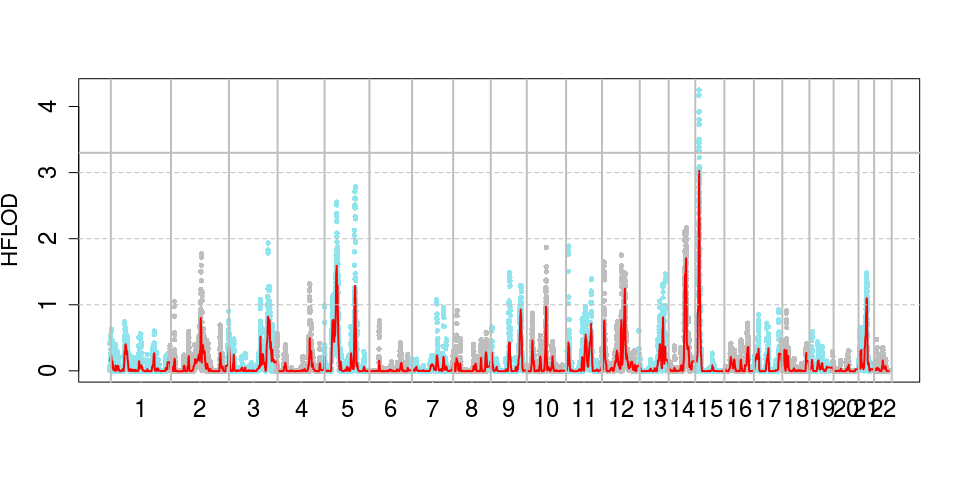
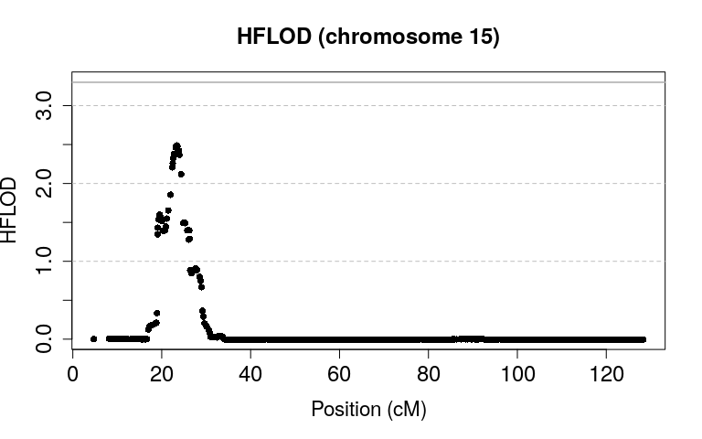
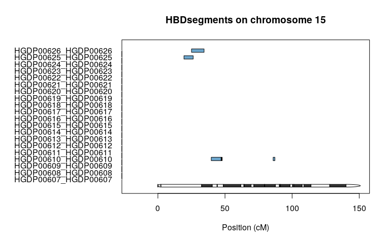
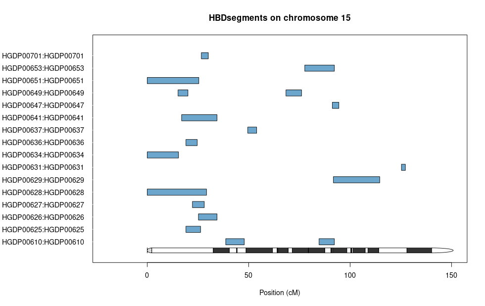
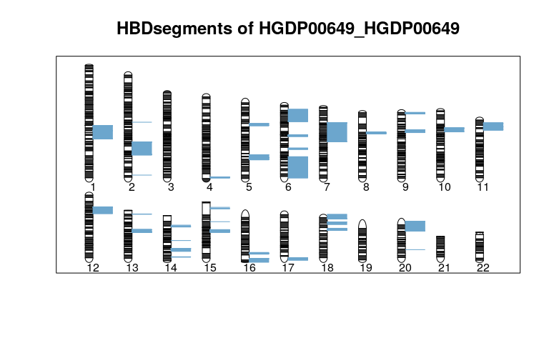
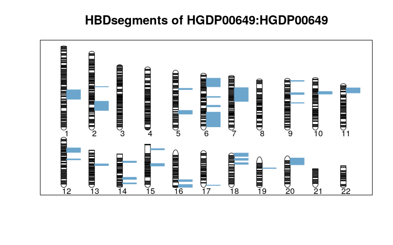

author: Isuru HAUPE & Marie MICHEL
date: 2019-12-05
meta-json: {"date":"2019-12-05","subtitle":"Version 0.1","output":"rmarkdown::html\\_vignette","version":"0.1","author":"Isuru HAUPE & Marie MICHEL","title":"Fantasio","vignette":"% % % % %"}
output: rmarkdown::html\_vignette
subtitle: Version 0.1
title: Fantasio
version: 0.1
vignette: % % % % %

-   [Introduction](#introduction)
    -   [Principal concepts](#principal-concepts)
-   [Getting started](#getting-started)
    -   [Installing Fantasio](#installing-fantasio)
    -   [Installing example data:
        HGDP-CEPH](#installing-example-data-hgdp-ceph)
-   [Running Fantasio](#running-fantasio)
    -   [Hotspots (Default)](#hotspots-default)
    -   [Hotspots by Segments](#hotspots-by-segments)
    -   [Distance](#distance)
    -   [How to use the `segment.option`
        argument](#how-to-use-the-segment.option-argument)
-   [Plotting results](#plotting-results)
    -   [HFLOD plots](#hflod-plots)
    -   [HBD plots](#hbd-plots)
-   [Step by step usage of the package
    Fantasio](#step-by-step-usage-of-the-package-fantasio)
    -   [Hotspots](#hotspots)
        -   [Creation of the segments
            list](#creation-of-the-segments-list)
        -   [Creation of the submaps and
            computation](#creation-of-the-submaps-and-computation)
        -   [Descrition of the object F1](#descrition-of-the-object-f1)
    -   [Hotspots by segments](#hotspots-by-segments-1)
        -   [Creation of the segments
            list](#creation-of-the-segments-list-1)
        -   [Creation of the submaps and
            computation](#creation-of-the-submaps-and-computation-1)
    -   [Distance](#distance-1)
        -   [Creation of the segments
            list](#creation-of-the-segments-list-2)
        -   [Creation of the submaps and
            computation](#creation-of-the-submaps-and-computation-2)
-   [Parallelism with the package](#parallelism-with-the-package)

Introduction
============

Fantasio is composed of several functions. Its goals are:

-   For population genetic studies: estimating and detecting inbreeding
    on individuals without known genealogy, estimating the population
    proportion of mating types and the individual probability to be
    offspring of different mating types
-   For rare disease studies: performing homozygosity mapping with
    heterogeneity
-   For multifactorial disease studies: HBD-GWAS strategy

Fantasio implements the creation of several random sparse submaps on
genome-wide data (to remove linkage disequilibrium). It also provides
graphical outputs to facilitate interpretations of homozygosity mapping
results and plots.

In this vignette, we illustrate how to use the package, using the data
set HGDP-CEPH, a ship which contains 1043 individuals and 660918
markers. In order to access the data, you will need to download the
HGDP.CEPH package (see below how) and load it.

Not all options of the functions are described here, but rather their
basic usage. The reader is advised to look at the manual page of the
function for details.

Principal concepts
------------------

Fantasio implements a maximum likelihood method that uses a hidden
Markov chain to model the dependencies along the genome between the
(observed) marker genotypes of an individual, and its (unobserved)
homozygous by descent (HBD) status. The emission probabilities of this
hidden Markov model (HMM) depend on the allele frequencies. The
transition probabilities depend on the genetic distance between two
adjacent markers. This model allows estimating the inbreeding
coefficient \\(f\\) of an individual, and a parameter \\(a\\), where
\\(af\\) is the instantaneous rate of change per unit map length (here
cM) from no HBD to HBD. Both HBD and non-HBD segment lengths are assumed
to be distributed exponentially with mean lengths \\(\frac{1}{a(1-f)}\\)
and \\(\frac{1}{af}\\), respectively.

The method requires the markers to be in minimal linkage disequilibrium
(LD). Otherwise biased estimations of \\(f\\) are produced. A strategy
consisting of generating multiple random sparse genome maps (submaps)
has been proposed to avoid this bias (Leutenegger et al. 2011). When
several submaps are considered, \\(f\\) is estimated as the median value
on all the f estimation obtained on the different maps after removing
submaps with \\(a > 1\\) (having an average HBD segment length of 1 cM
is unlikely to be detected with a SNP density of 1 per 0.5 cM). This
strategy has the advantage of not requiring any LD computation on the
sample and of minimizing loss of information, as compared with a
strategy that based on a single map of markers in minimal LD.

Fantasio statistical framework allows fixing HMM parameters to compute
the likelihood of a mating type. These likelihoods can be used for:

-   Inferring an individual as inbred by comparing the maximized
    likelihood with the one to be outbred with a likelihood ratio test
-   Estimating the population proportion of mating types
-   Estimating the individual probability to be into different mating
    types

When multiple submaps are used, the median p-values/probabilities are
considered. See Leutenegger et al. 2011 for more details on the
calculations.

Homozygosity mapping (Lander and Botstein 1987) consists in focusing on
inbred affected individuals and searching for a region of the genome of
shared homozygosity. Original homozygosity mapping requires that the
genealogy of patients be known so that inbred patients can be identified
and their respective \\(f\\) estimated. Leutenegger et al. (Leutenegger
et al. 2006) proposed using the \\(f\\) estimated on genome-wide genetic
data to compute a FLOD score, similar to Morton's LOD score (Morton
1955).

Genin et al. (Genin et al. 2012) adapted the FLOD formula for multiple
submaps. FLOD(i)(m,s) is computed for each individual \\(i\\), each
marker \\(m\\) on each submap \\(s\\), using the equation (1):

\\[FLOD^{(i)}(m,s) = log_{10}\frac{P\left(Y_{m,s}^{(i)} | H_{1}\right)}{P\left(Y_{m,s}^{(i)} | H_{0}\right)} = log_{10}\frac{P\left(X_{m,s}^{(i)}=1 | Y_{m,s}^{(i)}\right) + q.P\left(X_{m,s}^{(i)}=0 | Y_{m,s}^{(i)}\right)}{\hat{f}_s^{(i)} + q.\left(1-\hat{f}_s^{(i)}\right)}\\]

With the following parameters :

-   \\(Y_{m,s}^{(i)}\\) the observed genotype of individual *i* at
    marker *m* on submap *s*
-   \\(H_{1}\\) the hypothesis where marker \\(m\\) is linked to the
    disease, and \\(H_{0}\\) the one where it is not
-   \\(X_{m,s}^{(i)}\\) the HBD status of individual *i* at marker *m*
    on submap *s* that is estimated together with the inbreeding
    coefficient using the HMM of the package
-   \\(\hat{f}_s^{(i)}\\) the estimated inbreeding coefficient of
    individual *i* on submap *s*
-   *q* the assumed frequency of the mutation involved in the disease
    for this individual.

Results are then averaged over the different submaps to obtain a single
\\(FLOD^{(i)}(m)\\) at each marker *m*.

Genin et al. (Genin et al. 2012) proposed to detect fully penetrant rare
recessive variants by performing homozygosity mapping on inbred cases
from Genome-Wide Association Study (GWAS) data. Linkage evidence is then
evaluated over the entire set I of inbred cases by computing a FLOD
score, HFLOD(m,\\(\alpha\\)), at each marker *m*, in presence of genetic
heterogeneity using a parameter \\(\alpha\\) (2):

\\[HFLOD(m,\alpha)=\sum log_{10} \left[\alpha.\frac{P\left(Y_{m,s}^{(i)} | H_{1}\right)}{P\left(Y_{m,s}^{(i)} | H_{0}\right)}+ (1 - \alpha)\right ]= \sum log_{10} \left[\alpha . exp \left(FLOD^{(i)}(m) \times \log(10)\right)+(1-\alpha)\right] \\]

This heterogeneity score is then maximized over \\(\alpha\\) to evaluate
the evidence of linkage at marker *m* where \\(\alpha\\) is the estimate
of the proportion of cases linked to this locus (3):

\\[HFLOD(m)=max_{\alpha}(HFLOD(m,\alpha))\\]

Getting started
===============

The package `Fantasio` depends on `gaston`. Hereafter the functions of
this package are used for data manipulation. If you are not familiar
with `gaston`, please refer to the vignette of this package for more
information.

Installing Fantasio
-------------------

First and foremost install the package with the following command:

    install.packages("Fantasio")

After that we can load the package.

    require(Fantasio) 

    ## Loading required package: Fantasio

    ## Loading required package: parallel

    ## Loading required package: gaston

    ## Loading required package: Rcpp

    ## Loading required package: RcppParallel

    ## 
    ## Attaching package: 'RcppParallel'

    ## The following object is masked from 'package:Rcpp':
    ## 
    ##     LdFlags

    ## Gaston set number of threads to 2. Use setThreadOptions() to modify this.

    ## 
    ## Attaching package: 'gaston'

    ## The following object is masked from 'package:stats':
    ## 
    ##     sigma

    ## The following objects are masked from 'package:base':
    ## 
    ##     cbind, rbind

Installing example data: HGDP-CEPH
----------------------------------

We illustrate the usage of the package with the data provided in the
data package HGDP-CEPH. First, we need to install it:

    install.packages("HGDP.CEPH", repos="https://genostats.github.io/R/") 

We can load the HGDP-CEPH data as follows:

    require(HGDP.CEPH)

    ## Loading required package: HGDP.CEPH

    filepath <- system.file("extdata", "hgdp_ceph.bed", package="HGDP.CEPH")
    x <- read.bed.matrix(filepath)

    ## Reading /home/rv/R/x86_64-pc-linux-gnu-library/3.6/HGDP.CEPH/extdata/hgdp_ceph.rds 
    ## Reading /home/rv/R/x86_64-pc-linux-gnu-library/3.6/HGDP.CEPH/extdata/hgdp_ceph.bed

The object `x` is a bed.matrix object (see gaston package for details).
The statistics on SNPs and individual callrates, etc, have not been
computed; run

    x <- set.stats(x)

    ## ped stats and snps stats have been set. 
    ## 'p' has been set. 
    ## 'mu' and 'sigma' have been set.

to add them in the bed matrix. These data have genetic distances
(centiMorgans) set in the `@snps` slot, column `dist`:

    head(x@snps)

    ##   chr         id       dist     pos A1 A2  N0  N1  N2 NAs N0.f N1.f N2.f
    ## 1   1  rs3094315 0.09162711  742429  C  T  75 346 620   2   NA   NA   NA
    ## 2   1 rs12562034 0.09918407  758311  A  G  81 275 674  13   NA   NA   NA
    ## 3   1  rs3934834 0.49630053  995669  T  C  58 268 717   0   NA   NA   NA
    ## 4   1  rs9442372 0.50394850 1008567  A  G 149 423 471   0   NA   NA   NA
    ## 5   1  rs3737728 0.50800870 1011278  T  C  45 290 708   0   NA   NA   NA
    ## 6   1 rs11260588 0.50867275 1011521  A  G   3  49 991   0   NA   NA   NA
    ##   NAs.f  callrate        maf         hz
    ## 1    NA 0.9980825 0.23823247 0.33237272
    ## 2    NA 0.9875360 0.21213592 0.26699029
    ## 3    NA 1.0000000 0.18408437 0.25695110
    ## 4    NA 1.0000000 0.34563758 0.40556088
    ## 5    NA 1.0000000 0.18216683 0.27804410
    ## 6    NA 1.0000000 0.02636625 0.04697987

Most datasets come with physical positions (column `pos` in `@snps`),
but no genetic distance. They can be added with Gaston. First, you need
install the HumanGeneticMap package with
`install.packages("HumanGeneticMap", repos="https://genostats.github.io/R/")`.
Then, you would run

    x <- set.dist(x, HumanGeneticMap::genetic.map.b36)

as the SNP positions in these data are on hg18/b36 reference.

We are going to work on the Bedouin population. To select this
population run:

    x.be <- select.inds(x, population == "Bedouin")

Running Fantasio
================

Two differents methods for submaps creation are implemented in the
package:

-   "By Hotspots": with this method we use recombination hotspots to
    segment the genome. The package contains recombination hotspots for
    the Human Genome in builds 35 (hg17), 36 (hg18) and 37 (hg19) in
    datasets `hotspots_hg17`, `hotspots_hg18`,`hotspots_hg19`. The
    default recombination hotspots dataset used is `hotspots_hg19`.
    Segments should contain at least a user defined number of markers.
    Markers are then randomly selected within each segment along the
    genome. By doing this process we obtain a submap (a list of marker).

-   "By Distance" or "by SNPs": with this method we use a fixed step
    based on genetic or physiscal distance (0.5 cM by default) to pick a
    marker randomly along the genome. More technically, segments are
    created whenever there is a gap larger than the step (0.5 cM)
    between adjacent markers. Each segment is then subdivided in several
    mini-segments. By default we create 20 mini-segments, each
    containing at least 50 markers. If this is not possible (not enough
    markers), we do not create mini-segments. After this process is
    done, we loop over the mini-segments, pick a random marker and walk
    through the mini-segments by picking the nearest marker after taking
    a step (default 0.5 cM) downstream and upstream the mini-segments.

The function `Fantasio` calls two different functions for submaps
creation, based on the value of `segments`: `segmentsListByHotspots` and
`segmentsListByDistance`. The first function `segmentsListByDistance` is
used to create a list of segments though the genome. The second function
`makeAtlasByDistance` or `makeAllSubsmapsbyHotspots` is used to create
the submaps.

Hotspots (Default)
------------------

By default, the submaps are created using the file of recombination
hotspots and summarizing the results for each snp that appears in a
submap.

    F1 <- Fantasio(bedmatrix=x.be, segments="Hotspots", 
                   segment.options = list(hotspots = hotspot_hg18), n = 5, 
                   verbose = FALSE) 

    ## Warning in setSummary(h, probs = run.proba, recap.by.segments = recap.by.segments, : No individual with pheno = 2.
    ## Using all inbred individuals with good estimation quality.

The function `markerRepresentation` gives for each marker of the
original bed matrix the number of times it has been selected. It can be
used in conjonction with `table` to obtain a summary of the number of
markers never seen, seen once, twice, etc:

    head(markerRepresentation(F1), 10)

    ##            id chr     pos       dist Freq
    ## 1   rs3094315   1  742429 0.09162711    0
    ## 2  rs12562034   1  758311 0.09918407    0
    ## 3   rs3934834   1  995669 0.49630053    0
    ## 4   rs9442372   1 1008567 0.50394850    0
    ## 5   rs3737728   1 1011278 0.50800870    0
    ## 6  rs11260588   1 1011521 0.50867275    0
    ## 7   rs9442398   1 1011558 0.50878962    0
    ## 8   rs6687776   1 1020428 0.54737207    0
    ## 9   rs9651273   1 1021403 0.54793723    0
    ## 10  rs4970405   1 1038818 0.55291100    0

    table(markerRepresentation(F1)$Freq)

    ## 
    ##      0      1      2      3      4      5 
    ## 597120  56805   5770    849    167    207

The slot `F1@submap_summary` contains a summmary of results accross
submaps for all individuals:

    head(F1@submap_summary, 10)

    ##          FID       IID STATUS SUBMAPS QUALITY      F_MIN      F_MAX
    ## 1  HGDP00607 HGDP00607      1       5     100 0.02157463 0.02975595
    ## 2  HGDP00608 HGDP00608      1       5     100 0.03598537 0.04014125
    ## 3  HGDP00609 HGDP00609      1       5     100 0.03770926 0.04391735
    ## 4  HGDP00610 HGDP00610      1       5     100 0.04608449 0.05159924
    ## 5  HGDP00611 HGDP00611      1       5     100 0.00000000 0.00000000
    ## 6  HGDP00612 HGDP00612      1       5     100 0.05271932 0.06154670
    ## 7  HGDP00613 HGDP00613      1       5     100 0.00000000 0.00000000
    ## 8  HGDP00614 HGDP00614      1       5     100 0.02673050 0.02959198
    ## 9  HGDP00615 HGDP00615      1       5     100 0.08825122 0.09179361
    ## 10 HGDP00616 HGDP00616      1       5     100 0.06184717 0.07342747
    ##        F_MEAN   F_MEDIAN   A_MEDIAN   pLRT_MEDIAN INBRED pLRT_inf_0.05
    ## 1  0.02509236 0.02335224 0.12817870  7.712220e-36   TRUE             5
    ## 2  0.03727983 0.03690066 0.06623341  2.713908e-71   TRUE             5
    ## 3  0.03969614 0.03930664 0.10762384  2.408180e-72   TRUE             5
    ## 4  0.04907297 0.04996023 0.15620517  1.710978e-78   TRUE             5
    ## 5  0.00000000 0.00000000 0.01000000  1.000000e+00  FALSE             0
    ## 6  0.05633190 0.05428361 0.31500034  3.339610e-60   TRUE             5
    ## 7  0.00000000 0.00000000 0.01000000  1.000000e+00  FALSE             0
    ## 8  0.02843419 0.02861240 0.14528516  9.475249e-42   TRUE             5
    ## 9  0.09013144 0.08993900 0.09207497 1.113737e-170   TRUE             5
    ## 10 0.07049517 0.07208411 0.14735086 3.466959e-105   TRUE             5

If you are interested in the values of \\(f\\) and \\(a\\) accross the
submaps, you can find them in `F1@estimation_summary`.

The function also computed HBD probabilities that can be found in
`F1@HBD_recap`, which are used to determine the position of HBD
segments, which are recapitulated in `F1@HBDsegments`. It is required
that at least `n.consecutive.marker` markers are HBD before calling a
HBD segment. Default value is`n.consecutive.marker=5`.

Moreover, FLOD and HFLOD linkage statistics are computed. The FLOD of
each individual is in `F1@FLOD_recap`; they are used to compute the
whole sample statistics HFLOD in `F1@HFLOD`.

By default, the package only computes HBD, FLOD statistics and HFLOD
statistics for affected individuals (phenotype = 2). In case there are
no affected individuals, all individuals are taken into account (a
warning is issued). The `list.id` argument allows to specify a list of
individuals.

Hotspots by Segments
--------------------

For the "Hotspots" method, the results can also be summarized globally
for each segment using option `recap.by.segments=TRUE`. In that case,
`n.consecutive.marker` should be set to 1.

    F2 <- Fantasio(bedmatrix = x.be, segments = "Hotspots", 
                   segment.options = list(hotspots = hotspot_hg18), n = 5, 
                   recap.by.segments = TRUE, n.consecutive.marker = 1, verbose = FALSE)

    ## Warning in setSummary(h, probs = run.proba, recap.by.segments = recap.by.segments, : No individual with pheno = 2.
    ## Using all inbred individuals with good estimation quality.

Distance
--------

    F3 <- Fantasio(bedmatrix=x.be, segments="Distance", n = 5, verbose = FALSE)

    ## Warning in setSummary(h, probs = run.proba, recap.by.segments = recap.by.segments, : No individual with pheno = 2.
    ## Using all inbred individuals with good estimation quality.

In addition to all the above mentionned summaries, the function
`markerSummary` returns the number of SNPs in each submap. Note that
when \`segments = "Hotspots", it's always the number of hotspot
segments, but here it varies from submap to submap.

    head(markerSummary(F3))

    ##          number_of_markers_used
    ## Submap 1                   6235
    ## Submap 2                   6211
    ## Submap 3                   6225
    ## Submap 4                   6226
    ## Submap 5                   6221

How to use the `segment.option` argument
----------------------------------------

In order to use the `segment.option` argument you need to pass a list of
arguments, each variable name in the list must be an argument name in
the function. The function that will be called is either
`createsSegmentsListByDistance` if `segments` argument is equal to
"Distance" or `segmentsListByHotspots` if `segments` argument is equal
to "Hotspots" and the arguments list will be passed to it. So refer to
these functions for possible arguments.

    l <- list(hotspots = hotspot_hg18, minMarkers = 50) # default is 0
    F4 <- Fantasio(bedmatrix = x.be, segments = "Hotspots", segment.options = l)

In the case of "Hotspots", by default, we do not require to have a
minimum number of markers in each segment (`minMarkers = 0`). With the
above command line, we impose to have at least 50 markers in a segment.
Otherwise it is merged with the previous segment.

Plotting results
================

We illustrate the plotting function on the `F1` object obtained with
`segments="Hotspots"` and `F2` obtained with `segments="Hotspots"` and
`recap.by.segments=TRUE`.

HFLOD plots
-----------

This plot shows the values of the HFLOD linkage statistics along the
genome (contained in `F1@HFLOD`).

    HFLODManhattanPlot(F1)

The points are the HFLOD values. In the case of `F1`, they are computed
at every marker included in at least one submaps. The red line is the
value of their moving average (see below).

To plot a single chromosome, use the following function:

    HFLODplotChr(F1, chr=15)

-   The red line plotted is the moving average of the HFLOD, calculated
    on moving windows of 50 markers. This allows checking the
    consistency of HFLOD calculations (i.e. checking the fact that a
    high HFLOD score is not due to one submap only).

-   For method "Hotspots by segments", the use of the moving average
    does not make much sense as results are already averaged over the
    SNPs of a segment between hospots regions. We recommend using
    `MA=FALSE` as this:

<!-- -->

    HFLODplotChr(F2, chr=15, MA=FALSE)

HBD plots
---------

The HBD plots allow to visualize the positions of the HBD segments on
the genome, contained in `F1@HBDsegments`. You can plot multiple
individuals for one chromosome (by default, all individuals with \\(f\\)
significantly positive are plotted), as illustrated below with `F1` and
`F2`:

    HBDplotChr(F1, chr=15)

    HBDplotChr(F2, chr=15)

It is also possible to look at all HBD segments of a given individual
(again we show the results for `F1` and `F2`):

    HBDplotId(F1, individual.id = "HGDP00649", family.id = "HGDP00649")

    HBDplotId(F2, individual.id = "HGDP00649", family.id = "HGDP00649")

Step by step usage of the package Fantasio
==========================================

Hotspots
--------

### Creation of the segments list

We will now create segments, which will be use to create the submaps
later, further explication below, for now use this command :

    s1 <- segmentsListByHotspots(x.be, hotspots = hotspot_hg18)

    ## Using hotspots from  hotspot_hg18 
    ## Gathering all hotspots for the genome : ......................
    ## Gathering all the genome's markers : ......................
    ## Finding which markers are between two hotspots : ......................

This function creates a list of chromosomes, in each, you have a list of
several segments created thanks to the hotspots file given in argument
(files are given with the package), in each segments you have SNPs
index.

You can watch a summary of what was done with :

    segmentsListSummary(s1)

    ##    chromosome number_of_segments number_of_markers
    ## 1           1               1143             47146
    ## 2           2               1075             51611
    ## 3           3                939             42555
    ## 4           4                882             38215
    ## 5           5                870             39191
    ## 6           6                834             41404
    ## 7           7                726             34011
    ## 8           8                706             35659
    ## 9           9                699             29513
    ## 10         10                782             32753
    ## 11         11                663             30521
    ## 12         12                739             30331
    ## 13         13                574             23931
    ## 14         14                481             20314
    ## 15         15                509             18429
    ## 16         16                549             18487
    ## 17         17                475             15527
    ## 18         18                552             18911
    ## 19         19                323             10004
    ## 20         20                465             15759
    ## 21         21                262              9025
    ## 22         22                271              8956

This function creates a dataframe with three colums :

-   chromosome
-   number\_of\_segments
-   number\_of\_marker

### Creation of the submaps and computation

We will now head toward the creation of submaps using the following
commands :

    F1 <- makeAtlasByHotspots(x.be, 5, s1)
    F1 <- festim(F1)
    F1 <- setSummary(F1, list.id = "all")

For the sake of clarity we have only created 5 submaps, but generally we
do 100.

This function will creates 5 submaps, all the parameters can be modified
(use args(makeAtlasByHotspots) for more informations).

The variable submaps becomes an submapsList object, you can watch the
different elements of it with :

    str(F1) #careful it can become huge depending on your data sizes

### Descrition of the object F1

This object contains all the results of the different computations
executed during the process of creating n submaps. Here is a complete
description of each structure in this object :

-   segments\_list : the object Segments created previously (s1)

<!-- -->

    str(F1@segments_list) #careful it can become huge depending on your data sizes

-   submaps\_list : the list of all the submaps created during the
    process. Each element of the list is a S4 object. Depending on the
    method you used the object can be either a `snsp.matrix` or a
    `HostspotsMatrix` (here we use the hotspots method). Each submaps
    contains 15 slots :
    -   submap : the index of each marker picked (index from the
        bed.matrix object)
    -   ncol : the total number of marker picked
    -   nrow : the number of individuals
    -   ped : a dataframe with all the individuals' genotypes
    -   map : a dataframe with all the SNP information
    -   epsilon : genotyping error rate
    -   delta.dist : distance between each marker in cM/bp
    -   log.emiss : log of all the emission probabilities of the hidden
        Markov model
    -   a : a matrix with all the a's estimation
    -   f : a matrix with all the f's estimation
    -   likelihood0 : a matrix with all the likehood under the null
        hypothesis (\\(f=0\\))
    -   likelihood1 : a matrix with all the likehood under the inbred
        hypothesis (\\(f=1\\))
    -   p.lrt : p value of the likelihood ratio test
    -   HBD.prob : a matrix with all the HBD probabilities computed for
        each individual
    -   FLOD : a matrix with all the FLOD score computed

<!-- -->

    str(F1@submaps_list)

-   likelihood\_summary : a dataframe with all the likelihood0 and
    likelihood1 computed over the submaps.

<!-- -->

    str(F1@likelihood_summary)

-   estimation\_summary : a dataframe with all the a and f computed over
    the submaps

<!-- -->

    str(F1@estimation_summary)

-   submaps\_summary : a dataframe which gives several informations
    about the a and f computed over the submaps. The dataframe contains
    13 columns:
    -   FID: family identifier
    -   IID: individual identifier
    -   STATUS: status (1 non-affected, 2 affected, 0 unknown)
    -   SUBMAPS: number of submaps used
    -   QUALITY: percentage of valid submaps (i.e. submaps with a
        &lt; 1)
    -   F\_MIN: minimum f on valid submaps
    -   F\_MAX: maximum f on valid submaps
    -   F\_MEAN: mean f on valid submaps
    -   F\_MEDIAN: median f on valid submaps (recommended to estimate f)
    -   A\_MEDIAN: median a on valid submaps (recommended to estimate a)
    -   pLRT\_MEDIAN: median p-value of LRT tests on valid submaps
    -   INBRED: a flag indicating if the individual is inbred
        (pLRT\_MEDIAN &lt; 0.05) or not
    -   pLRT\_&lt;0.05: number of valid submaps with a LRT (likelihood
        ratio test) having a p-value below 0.05

<!-- -->

    head(F1@submap_summary)

    ##         FID       IID STATUS SUBMAPS QUALITY      F_MIN      F_MAX
    ## 1 HGDP00607 HGDP00607      1       5     100 0.02285938 0.02736264
    ## 2 HGDP00608 HGDP00608      1       5     100 0.03522362 0.04283326
    ## 3 HGDP00609 HGDP00609      1       5     100 0.03725644 0.04265333
    ## 4 HGDP00610 HGDP00610      1       5     100 0.04620609 0.05513670
    ## 5 HGDP00611 HGDP00611      1       5     100 0.00000000 0.00000000
    ## 6 HGDP00612 HGDP00612      1       5     100 0.04960362 0.05981393
    ##       F_MEAN   F_MEDIAN   A_MEDIAN  pLRT_MEDIAN INBRED pLRT_inf_0.05
    ## 1 0.02502562 0.02448654 0.12492400 2.331201e-39   TRUE             5
    ## 2 0.03920225 0.03859060 0.06508525 1.179229e-70   TRUE             5
    ## 3 0.03971927 0.04050947 0.11307391 3.476406e-75   TRUE             5
    ## 4 0.04983107 0.04942325 0.14693226 2.746219e-81   TRUE             5
    ## 5 0.00000000 0.00000000 0.01000000 1.000000e+00  FALSE             0
    ## 6 0.05436803 0.05333275 0.29343698 1.206360e-55   TRUE             5

-   bySegments : a boolean indicating whether the creation of summary
    statistics for HBD and FLOD has to be made by segments or not. By
    default, it is FALSE. The description below of HBD\_recap and
    FLOD\_recap depends on this choice.

-   HBD\_recap : a dataframe with individuals in row and marker
    positions in column. It contains the mean of the HBD probability at
    a marker over the submaps for each individual. If the marker only
    appears in one submap (no mean needed), then it is just the HBD
    proba for that marker in that submap.

<!-- -->

    F1@HBD_recap[1:10, 1:10] # an individual * marker matrix

-   FLOD\_recap : a dataframe like above. It contains the mean of the
    FLOD score at a marker over the submaps for each individual. Again
    if a marker only appears in one submap, no mean is needed.

<!-- -->

    F1@FLOD_recap[1:10, 1:10] # an individual * marker matrix

-   HBDsegments : a list of dataframe, each datafram is for an
    individual and it contains a list of HBDsegments (start and end
    positions). By default, a region is HBD if it contains at least 5
    markers (n.consecutive.marker=5) with a HBD probability larger than
    0.5 (threshold=0.5).

<!-- -->

    str(F1@HBDsegments[[1]])

-   HFLOD : a dataframe with the value of HFLOD scores for every markers
    that appeared at least once in a submap. It uses the formula (2)
    with FLOD\_recap to obtain HFLOD.

<!-- -->

    str(F1@HFLOD)

-   bedmatrix : the bedmatrix object

<!-- -->

    str(F1@bedmatrix)

-   unit : the unit of the marker (cM or Bp).

Hotspots by segments
--------------------

We implemented a second inner method for the "Hotspots" method. The only
paramater that changes is `recap.by.segments`, it is put to TRUE.

In the default "Hotspots" method the HBD probabilities and FLOD scores
are computed for each marker (see above).

With the "Hotspots by segment" method, HBD probabilities and FLOD scores
correspond to the mean of HBD probabilities and FLOD score of all the
markers of a segment that have been selected in one of the sumaps. There
is hence only one value for a segment delimited by hotspots. So we also
recommend to set n.consecutive.marker to 1. Since results over multiple
markers have already been averaged.

### Creation of the segments list

We use the same segment list that is used before (s1).

### Creation of the submaps and computation

As said before the only argument that changes is "recap.by.segments", it
is put to TRUE. And we recommend to adjust "n.consecutive.marker".

    F2 <- makeAtlasByHotspots(x.be, 5, s1)
    F2 <- festim(F2)
    F2 <- setSummary(F2, recap.by.segments = TRUE, n.consecutive.marker = 1, list.id = "all")

Distance
--------

### Creation of the segments list

We will now create segments, which will be used to create the submaps
later :

    s3 <- segmentsListByDistance(x.be)

    ## Finding segments for the genome : .......................
    ## Finding which markers are between two segments: .......................
    ## Finding mini segments .......................

This function creates segments based on the markers available in the
data and the gaps between them. The value of the gap is imposed by the
minimun step required between markers. If 2 adjacent markers have an
inter-distance larger than the step, then there is a gap between them.
The first marker of the pair is the end of a segment and the second
marker is the start of a new segment. The function creates an object
which will contain three slots :

-   gap : the value of the minimal fix step required between sampled
    markers of a submap
-   unit : the unit of the markers ("cM" or "Bp") snpsSegments : for
    each chromosome, the
-   list of segments; each segment being a list of SNP indexes

You can watch a summary of what was done with :

    segmentsListSummary(s3)

This function creates a dataframe with three colums :

-   chromosome
-   number\_of\_segments
-   number\_of\_marker

### Creation of the submaps and computation

We will now head toward the creation of submaps using the following
commands :

    F3 <- makeAtlasByDistance(x.be, 5, s3)
    F3 <- festim(F3)
    F3 <- setSummary(F3, list.id = "all")

The variable submaps becomes an submapsList object, you can watch the
different elements of it with :

    str(F3) # careful it can become huge depending on your data sizes

Parallelism with the package
============================

We implemented a paralellism method to make the creation of the submaps
more efficient. We paralellized the creation of the submaps, that is to
say, the selection of markers. Make sure to have an environment that can
support the usage of multiple CPU.

Use the `n.cores` argument, i.e the number of CPU that will be used to
make the differents submaps in the functions `Fantasio`,
`makeAtlasByHotspots`, `makeAtlasByDistance` :

    F1 <- Fantasio(bedmatrix = x.be, segments = "Hotspots", 
                   segment.options = list(hotspots = hotspot_hg18), n = 5, 
                   verbose = FALSE, n.cores = 10)
