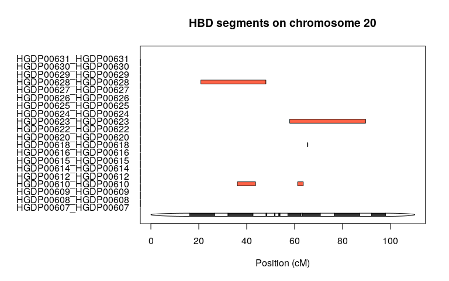
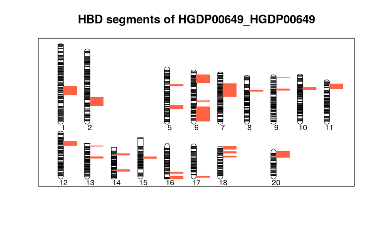
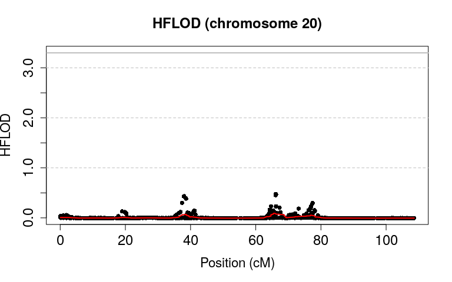

Introduction
------------

Fantasio is composed of several functions. Its goals are for:

-   Population genetic studies (estimating and detecting inbreeding on
    individuals without known genealogy, estimating the population
    proportion of mating types and the individual probability to be
    offspring of different mating types)
-   Rare disease studies (performing homozygosity mapping with
    heterogeneity)
-   Multifactorial disease studies (HBD-GWAS strategy).

Fantasio implements the creation of several random sparse submaps on
genome-wide data (to remove linkage disequilibrium). It also provides
graphical outputs to facilitate interpretations of homozygosity mapping
results and plots.

In this vignette, we illustrate how to use the package, using the data
set HGDP-CEPH, a ship which contains 1043 individuals and 660918
markers. In order to access the data, you will need to download the
HGDP.CEPH package (see below how) and load it.

Not all options of the functions are described here, but rather their
basic usage. The reader is advised to look at the manual page of the
function for details.

### Principal concepts

Fantasio is a maximum likelihood method that uses a hidden Markov chain
to model the dependencies along the genome between the (observed) marker
genotypes of an individual, and its (unobserved) homozygous by descent
(HBD) status. The emission probabilities of this hidden Markov model
(HMM) depend on the allele frequencies. The transition probabilities
depend on the genetic distance between two adjacent markers. This model
allows estimating the inbreeding coefficient *f* of an individual, and a
parameter *a*, where *a**f* is the instantaneous rate of change per unit
map length (here cM) from no HBD to HBD. Both HBD and non-HBD segment
lengths are assumed to be distributed exponentially with mean lengths
$\\frac{1}{a(1-f)}$ and $\\frac{1}{af}$, respectively.

Fantasio requires the markers to be in minimal linkage disequilibrium
(LD). Otherwise biased estimations of *f* are produced. A strategy
consisting of generating multiple random sparse genome maps (submaps)
has been proposed to avoid this bias (Leutenegger et al. 2011). When
several submaps are considered, *f* is estimated as the median value of
the estimates obtained on the different maps after removing submaps with
*a* &gt; 1 (having an average HBD segment length of 1 cM is unlikely to
be detected with a SNP density of 1 per 0.5 cM). This strategy has the
advantage of not requiring any LD computation on the sample and of
minimizing loss of information, as compared with a strategy that based
on a single map of markers in minimal LD.

Fantasio compute the likelihood of a mating type. These likelihoods can
be used for:

-   Inferring an individual as inbred by comparing the maximized
    likelihood with the one to be outbred with a likelihood ratio test
-   Estimating the population proportion of mating types
-   Estimating the individual probability to be into different mating
    types

When multiple submaps are used, the median p-values/probabilities are
considered. See Leutenegger et al. 2011 for more details on the
calculations.

Homozygosity mapping (Lander and Botstein 1987) consists in focusing on
inbred affected individuals and searching for a region of the genome of
shared homozygosity. Original homozygosity mapping requires that the
genealogy of patients be known so that inbred patients can be identified
and their respective *f* estimated. Leutenegger et al. (Leutenegger et
al. 2006) proposed using the *f* estimated on genome-wide genetic data
to compute a FLOD score, similar to Mortons LOD score (Morton 1955).
This FLOD score can be computed on isolated cases or on nuclear
families.

Genin et al. (Genin et al. 2012) adapted the FLOD formula for multiple
submaps. FLOD(i)(m,s) is computed for each individual *i*, each marker
*m* on each submap *s*, using the equation:

$$FLOD^{(i)}m,s = log\_{10}\\frac{P\\left(Y\_{m,s}^{(i)} | H\_{1}\\right)}{P\\left(Y\_{m,s}^{(i)} | H\_{0}\\right)} = log\_{10}\\frac{P\\left(X\_{m,s}^{(i)}=1 | Y\_{m,s}^{(i)}\\right) + q.P\\left(X\_{m,s}^{(i)}=1 | Y\_{m,s}^{(i)}\\right)}{\\hat{f}\_s^{(i)} + q.\\left(1-\\hat{f}\_s^{(i)}\\right)}$$

With the following parameters :

-   *Y**m*, *s*(*i*) the observed genotype of
    individual *i* at marker *m* on submap *s*
-   *H*1 the hypothesis where
    *Y**m*, *s*(*i*) is linked to the disease, and
    *H*0 the one where it is not
-   *X**m*, *s*(*i*) the HBD status of individual
    *i* at marker *m* on submap *s* that is estimated together with the
    inbreeding coefficient using the HMM of Fantasio
-   $\\hat{f}\_s^{(i)}$ the estimated inbreeding coefficient of
    individual *i* on submap *s* This heterogeneity score is then
    maximized over α to evaluate the evidence of linkage at marker m
-   *q* the assumed frequency of the mutation involved in the disease
    for this individual.

Results are then averaged over the different submaps to obtain a single
*F**L**O**D*(*i*)(*m*) at each marker *m*.

Genin et al. (Genin et al. 2012) proposed to detect fully penetrant rare
recessive variants by performing homozygosity mapping on inbred cases
from Genome-Wide Association Study (GWAS) data. Linkage evidence is then
evaluated over the entire set I of inbred cases by computing a FLOD
score, HFLOD(m,α), at each marker m, with a heterogeneity parameter α,
that takes into account the possibility that only a fraction of the
inbred affected individuals carry diseases causing mutations:

$$HFLOD(m,\\alpha)=\\sum log\_{10} \\left\[\\alpha.\\frac{P\\left(Y\_{m,s}^{(i)} | H\_{1}\\right)}{P\\left(Y\_{m,s}^{(i)} | H\_{0}\\right)}+ (1 - \\alpha)\\right \]= \\sum log\_{10} \\left\[\\alpha . exp \\left(FLOD^{(i)}(m)\*log(10)\\right)+(1-\\alpha)\\right\] $$
 This heterogeneity score is then maximized over *α* to evaluate the
evidence of linkage at marker *m* where *α* is the estimate of the
proportion of cases linked to this locus:
*H**F**L**O**D*(*m*)=*m**a**x**α*(*H**F**L**O**D*(*m*, *α*))

1. Getting started
------------------

The first thing you should know is that the package Fantasio depends on
package gaston, please make sure to have it installed.

Please refer to the vignette of this package for more information.

Since we explained the concept behind the package let's make an usage
example of it. For this we will use the data furnish by the package
HGDP.

### 1.1 Installation

First and faremost install the package with the following command :

    install.packages("Fantasio")

After doing that we will need to run the following commands :

    require(Fantasio) 

    ## Loading required package: Fantasio

    ## Loading required package: parallel

    ## Loading required package: gaston

    ## Loading required package: Rcpp

    ## Loading required package: RcppParallel

    ## 
    ## Attaching package: 'RcppParallel'

    ## The following object is masked from 'package:Rcpp':
    ## 
    ##     LdFlags

    ## Gaston set number of threads to 4. Use setThreadOptions() to modify this.

    ## 
    ## Attaching package: 'gaston'

    ## The following object is masked from 'package:stats':
    ## 
    ##     sigma

    ## The following objects are masked from 'package:base':
    ## 
    ##     cbind, rbind

    install.packages("HGDP.CEPH", repos="https://genostats.github.io/R/") #in order to download the dataset from which will work on.

    require(HGDP.CEPH)

    ## Loading required package: HGDP.CEPH

### 1.2 Input data file

From now on, we can use the package. Let us first create our bed.matrix
object using the data file we load with the package HGDP.CEPH.

    filepath <-system.file("extdata", "hgdp_ceph.bed", package="HGDP.CEPH")

### 1.3 Creation of the bed matrix

First create your bed.matrix object with this command :

    x <- read.bed.matrix(filepath)

    ## Reading C:/Users/haupe/Documents/R/win-library/3.4/HGDP.CEPH/extdata/hgdp_ceph.rds 
    ## Reading C:/Users/haupe/Documents/R/win-library/3.4/HGDP.CEPH/extdata/hgdp_ceph.bed

Then return an updated 'bed.matrix' with new variables for several basic
statistics :

    x <- set.stats(x)

    ## ped stats and snps stats have been set. 
    ## 'p' has been set. 
    ## 'mu' and 'sigma' have been set.

Here we only want to work on the Bedouin's data, so we selected this
population with the following command :

    x.me <- select.inds(x, population == "Bedouin")

Please refer to the manual function of read.bed.matrix, set.stats and
select.inds if needed (package gaston).

As Fantasio computes only for people affected by a disease, we change
the STATUS of every individuals from 0 (=unknown) to 2 (=affected) :

    x.me <- set.status(x.me, 2)

You can insure that your bed.matrix object is created and have the data
needed with :

    str(x.me)

    ## Formal class 'bed.matrix' [package "gaston"] with 8 slots
    ##   ..@ ped                 :'data.frame': 48 obs. of  34 variables:
    ##   .. ..$ famid      : chr [1:48] "HGDP00607" "HGDP00608" "HGDP00609" "HGDP00610" ...
    ##   .. ..$ id         : chr [1:48] "HGDP00607" "HGDP00608" "HGDP00609" "HGDP00610" ...
    ##   .. ..$ father     : int [1:48] 0 0 0 0 0 0 0 0 0 0 ...
    ##   .. ..$ mother     : int [1:48] 0 0 0 0 0 0 0 0 0 0 ...
    ##   .. ..$ sex        : int [1:48] 2 1 1 1 1 2 2 2 2 1 ...
    ##   .. ..$ pheno      : num [1:48] 2 2 2 2 2 2 2 2 2 2 ...
    ##   .. ..$ population : Factor w/ 57 levels "Adygei","Balochi",..: 10 10 10 10 10 10 10 10 10 10 ...
    ##   .. ..$ region     : Factor w/ 27 levels "Algeria (Mzab)",..: 12 12 12 12 12 12 12 12 12 12 ...
    ##   .. ..$ region7    : Factor w/ 7 levels "Africa","America",..: 6 6 6 6 6 6 6 6 6 6 ...
    ##   .. ..$ H952       : logi [1:48] TRUE TRUE TRUE TRUE TRUE TRUE ...
    ##   .. ..$ N0         : int [1:48] 56890 58576 58375 60261 53403 61180 54121 55903 61857 62151 ...
    ##   .. ..$ N1         : int [1:48] 192705 189349 190265 186828 203585 183119 199168 196327 183012 180747 ...
    ##   .. ..$ N2         : int [1:48] 394377 395838 394286 396726 386823 399508 390610 391298 398496 401153 ...
    ##   .. ..$ NAs        : int [1:48] 301 510 1347 458 462 466 374 745 908 222 ...
    ##   .. ..$ N0.x       : int [1:48] 1514 3766 4313 4160 4434 1476 1491 1540 2261 4107 ...
    ##   .. ..$ N1.x       : int [1:48] 4936 0 0 0 0 4847 5354 5112 3243 0 ...
    ##   .. ..$ N2.x       : int [1:48] 10017 12688 12136 12289 12008 10140 9599 9810 10953 12361 ...
    ##   .. ..$ NAs.x      : int [1:48] 5 18 23 23 30 9 28 10 15 4 ...
    ##   .. ..$ N0.y       : int [1:48] 0 0 0 0 0 0 0 0 0 0 ...
    ##   .. ..$ N1.y       : int [1:48] 0 0 0 0 0 0 0 0 0 0 ...
    ##   .. ..$ N2.y       : int [1:48] 0 10 10 10 10 0 0 0 0 10 ...
    ##   .. ..$ NAs.y      : int [1:48] 10 0 0 0 0 10 10 10 10 0 ...
    ##   .. ..$ N0.mt      : int [1:48] 4 9 19 5 9 9 4 5 19 1 ...
    ##   .. ..$ N1.mt      : int [1:48] 0 0 0 0 0 0 0 0 0 0 ...
    ##   .. ..$ N2.mt      : int [1:48] 157 143 141 157 153 151 157 153 140 161 ...
    ##   .. ..$ NAs.mt     : int [1:48] 2 11 3 1 1 3 2 5 4 1 ...
    ##   .. ..$ callrate   : num [1:48] 1 0.999 0.998 0.999 0.999 ...
    ##   .. ..$ hz         : num [1:48] 0.299 0.294 0.296 0.29 0.316 ...
    ##   .. ..$ callrate.x : num [1:48] 1 0.999 0.999 0.999 0.998 ...
    ##   .. ..$ hz.x       : num [1:48] 0.3 0 0 0 0 ...
    ##   .. ..$ callrate.y : num [1:48] 0 1 1 1 1 0 0 0 0 1 ...
    ##   .. ..$ hz.y       : num [1:48] NaN 0 0 0 0 NaN NaN NaN NaN 0 ...
    ##   .. ..$ callrate.mt: num [1:48] 0.988 0.933 0.982 0.994 0.994 ...
    ##   .. ..$ hz.mt      : num [1:48] 0 0 0 0 0 0 0 0 0 0 ...
    ##   ..@ snps                :'data.frame': 660918 obs. of  17 variables:
    ##   .. ..$ chr     : int [1:660918] 1 1 1 1 1 1 1 1 1 1 ...
    ##   .. ..$ id      : chr [1:660918] "rs3094315" "rs12562034" "rs3934834" "rs9442372" ...
    ##   .. ..$ dist    : num [1:660918] 0.0916 0.0992 0.4963 0.5039 0.508 ...
    ##   .. ..$ pos     : int [1:660918] 742429 758311 995669 1008567 1011278 1011521 1011558 1020428 1021403 1038818 ...
    ##   .. ..$ A1      : chr [1:660918] "C" "A" "T" "A" ...
    ##   .. ..$ A2      : chr [1:660918] "T" "G" "C" "G" ...
    ##   .. ..$ N0      : int [1:660918] 3 4 6 16 3 0 3 5 8 3 ...
    ##   .. ..$ N1      : int [1:660918] 23 15 15 21 16 1 21 13 18 10 ...
    ##   .. ..$ N2      : int [1:660918] 22 29 27 11 29 47 24 30 22 35 ...
    ##   .. ..$ NAs     : int [1:660918] 0 0 0 0 0 0 0 0 0 0 ...
    ##   .. ..$ N0.f    : int [1:660918] NA NA NA NA NA NA NA NA NA NA ...
    ##   .. ..$ N1.f    : int [1:660918] NA NA NA NA NA NA NA NA NA NA ...
    ##   .. ..$ N2.f    : int [1:660918] NA NA NA NA NA NA NA NA NA NA ...
    ##   .. ..$ NAs.f   : int [1:660918] NA NA NA NA NA NA NA NA NA NA ...
    ##   .. ..$ callrate: num [1:660918] 1 1 1 1 1 1 1 1 1 1 ...
    ##   .. ..$ maf     : num [1:660918] 0.302 0.24 0.281 0.448 0.229 ...
    ##   .. ..$ hz      : num [1:660918] 0.479 0.312 0.312 0.438 0.333 ...
    ##   ..@ bed                 :<externalptr> 
    ##   ..@ p                   : num [1:660918] 0.698 0.76 0.719 0.448 0.771 ...
    ##   ..@ mu                  : num [1:660918] 1.396 1.521 1.438 0.896 1.542 ...
    ##   ..@ sigma               : num [1:660918] 0.61 0.652 0.712 0.751 0.617 ...
    ##   ..@ standardize_p       : logi FALSE
    ##   ..@ standardize_mu_sigma: logi FALSE

This object contains two slots :

-   ped : which gives you informations about all the individuals in the
    chipset
-   snps : which gives you informations about the snps itself

More information in the vignette of the gaston package.

2. Wrapper
----------

We created a wrapper to make it easy to use the package.

The function calls two differents functions : `createSegmentsListBySnps`
and `createSegmentsListBySnps`. The first function
`createSegmentsListBySnps` is used to create a list of segments though
the genome. The second function `makeAllSubmapsBySnps` or
`makeAllSubsmapsbyHotspots` is used to create submaps.

The segments arguments accept only two options : Hotspots or Distance.

### 2.1 By Hotspots

    submaps2 <- Fantasio(bedmatrix=x.me, segments="Hotspot", n=5, verbose=FALSE) #for clarity sake we put verbose to FALSE

### 2.2 By Hotspots by Segments

    submaps3 <- Fantasio(bedmatrix=x, segments="Hotspots", segment.options=l, n=100, n.cores=20, recap.by.segments=TRUE, n.consecutive.marker=1)

### 2.3 By Distance

    submaps4 <- Fantasio(bedmatrix=x.me, segments="Distance", n=5, verbose=FALSE) #for clarity sake we put verbose to FALSE

### 2.4 How to use the segment.option argument

In order to use the `segment.option` argument you need to pass a list of
arguments, each variable names in the list are an argument in the
function. The function that will be called is either
`createsSegmentsListBySnps` if `segments` argument is equal to
"Distance" or `createSegmentsListByHotspots`if `segments` argument is
equal to "Hotspots" and the arguments list will be pass to it.

    l <- list(number_of_marker=50) #default is 0
    submaps5 <- Fantasio(bedmatrix=x, segments="Hotspots", segment.options=l, n=5, recap.by.segments=TRUE)

3. Step by step usage of the package Fantasio
---------------------------------------------

We implemented in the package Fantasio two differents methods in order
to create the submaps :

-   By "Hotspots" : \*With this method we use hotspots files to segment
    our data, each segment contains several markers. Once this step is
    done we then loop over the segments and pick one marker randomly.
    By  
    doing this process we obtain a submap (a list of marker).

-   By "Distance" : \*With this method we use the gaps between markers
    to segment our data, each segment contains several  
    markers. We then create mini-segments for each marker (by default we
    create 20 segments, each containing at least 50 markers, if the
    creation of 20 segments in each we have 50 markers is impossible we
    do not create mini-segments). After this process is done, we loop
    over the mini-segments, pick a random marker and go through the
    mini-segments by picking the nearest marker after taking a step
    (default is 0,5 cM) downstream and upstream the mini-segments.

### 3.1 "By hotspots" method

#### 3.1.1 Creation of the segments list

We will now create segments, which will be use to create the submaps
later, further explication below, for now use this command :

    s <- createSegmentsListByHotspots(x.me)

    ## You are currently using version hg19 of hotspot
    ## Gathering all hotspots for the genome : ......................
    ## Gathering all the genome's markers : ......................
    ## Finding which markers are between two hotspots : ......................

This function creates a list of chromosomes, in each, you have a list of
several segments created thanks to the hotspots file given in argument
(files are given with the package), in each segments you have SNPs
index.

You can watch a summary of what was done with :

    segmentsListSummary(s)

    ##    chromosome number_of_segments number_of_markers
    ## 1           1                904             48532
    ## 2           2                895             52722
    ## 3           3                750             43507
    ## 4           4                702             39040
    ## 5           5                721             39933
    ## 6           6                719             42184
    ## 7           7                564             34754
    ## 8           8                589             36417
    ## 9           9                563             30276
    ## 10         10                669             33427
    ## 11         11                537             31255
    ## 12         12                601             31039
    ## 13         13                475             24595
    ## 14         14                401             20926
    ## 15         15                383             19098
    ## 16         16                429             19028
    ## 17         17                374             16052
    ## 18         18                442             19496
    ## 19         19                217             10397
    ## 20         20                384             16228
    ## 21         21                225              9301
    ## 22         22                207              9379

This function creates a dataframe with three colums :

-   chromosome
-   number\_of\_segments
-   number\_of\_marker

Now further explanations about why we did that.

This package is mainly used to exploit inbreeding in dense SNPS chip and
exome data.

To do this we use a technique called submapping.

Let's imagine that our current data is like a map, with all the
informations about our individuals and our SNPS, we use this main "map"
to create submap, each submap can be considered as a smaller, genome map
about our data.

We use this technique because we want to avoid linkage desequilibrium.
(See introduction for more information.)

Depending on the method you are using ("By Hotspots" or by "Distance"),
we have a submap : a list of markers. We normally repeat this process
aroung a hundred times to make sure that we have no linkage
desequilibrium.

Only thing left to do is to compute some probabilities about those
submaps (HBD, FLOD score, HFLOD score ...).

#### 3.1.2 Creation of the submaps and computation

After those explanations we will now head toward the creation of submaps
using the following commands :

    submaps <- makeAllSubmapsByHotspots(x.me, 5, s, verbose=FALSE) #suppressing messages to avoid unnecesary warnings

For the sake of clarity we had only created 5 submaps, but generally we
do 100.

This function will creates 5 submaps, all the parameters can be modified
(use args(makeAllSubmapsByHotspots) for more informations).

The variable submaps becomes an list.submaps object, you can watch the
different elements of it with :

    str(submaps) #careful it can become huge depending on your data sizes

#### 3.1.3 Descrition of the object submaps

This object contains all the results of the different computation
executed during the process of creating n submaps. Here is a complete
description of each structure in this object :

-   segments\_list : the object Segments created previously

<!-- -->

    str(submaps@segments_list) #careful it can become huge depending on your data sizes

-   atlas : the list of all the submaps created during the process. Each
    element of the list is an S4 object. Depending on the method you
    used the object can be either an snsp.matrix or an hotspots.matrix
    (here we use the hotspots method). Each submaps contains 14 slots :
-   submap : the index of each marker picked
-   ncol : the total number of marker picked
-   nrow : the number of individuals
-   ped : a dataframe with all the individuals genotype
-   map : a dataframe with all the SNPS informations
-   epsilon : genotyping error rate
-   delta.dist : distance between each marker in cM/bp
-   log.emiss : log of all the emission probabilities of the hidden
    Markov model
-   a : a matrix with all the a's estimation
-   f : a matrix with all the f's estimation
-   likelihood0 : a matrix with all the likehood under the null
    hypothesis (*f* = 0)
-   p.lrt : p value of the likelihood ratio test
-   HBD.prob : a matrix with all the HBD probabilities computed for each
    individual
-   FLOD : a matrix with all the FLOD score computed

<!-- -->

    str(submaps@atlas)

-   likelihood\_summary : a dataframe with all the likelihood0 and
    likelihood1 computed over the submaps.

<!-- -->

    str(submaps@likelihood_summary)

-   estimation\_summary : a dataframe with all the a and f computed over
    the submaps

<!-- -->

    str(submaps@estimation_summary)

-   marker\_summary : a dataframe, which gives the number of marker and
    the number of times it has been picked,
    -   number\_of\_time\_picked
    -   number\_of\_marker

<!-- -->

    str(submaps@marker_summary)

-   submaps\_summary : a dataframe which gives several informations
    about the a and f computed over the submaps. The dataframe contains
    13 columns:
-   FID: family identifier
-   IID: individual identifier
-   STATUS: status (1 non-affected, 2 affected, 0 unknown)
-   SUBMAPS: number of submaps used
-   QUALITY: percentage of valid submaps (i.e. submaps with a &lt; 1)
-   F\_MIN: minimum f on valid submaps
-   F\_MAX: maximum f on valid submaps
-   F\_MEAN: mean f on valid submaps
-   F\_MEDIAN: median f on valid submaps (recommended to estimate f)
-   A\_MEDIAN: median a on valid submaps (recommended to estimate a)
-   pLRT\_MEDIAN: median p-value of LRT tests on valid submaps
-   INBRED: a flag indicating if the individual is inbred (pLRT\_MEDIAN
    &lt; 0.05) or not
-   pLRT\_&lt;0.05: number of valid submaps with a LRT having a p-value
    below 0.05

<!-- -->

    submaps@submap_summary

    ##          FID       IID STATUS SUBMAPS QUALITY       F_MIN      F_MAX
    ## 1  HGDP00607 HGDP00607      2   5 / 5     100 0.018971753 0.02640358
    ## 2  HGDP00608 HGDP00608      2   5 / 5     100 0.036386952 0.03962816
    ## 3  HGDP00609 HGDP00609      2   5 / 5     100 0.037323455 0.04971140
    ## 4  HGDP00610 HGDP00610      2   5 / 5     100 0.050574519 0.05587903
    ## 5  HGDP00611 HGDP00611      2   1 / 5      20 0.010642143 0.01064214
    ## 6  HGDP00612 HGDP00612      2   5 / 5     100 0.048774640 0.06161077
    ## 7  HGDP00613 HGDP00613      2   5 / 5     100 0.000000000 0.00000000
    ## 8  HGDP00614 HGDP00614      2   5 / 5     100 0.030779458 0.03433435
    ## 9  HGDP00615 HGDP00615      2   5 / 5     100 0.087399494 0.09409665
    ## 10 HGDP00616 HGDP00616      2   5 / 5     100 0.066058208 0.07569662
    ## 11 HGDP00617 HGDP00617      2   4 / 5      80 0.000000000 0.01436113
    ## 12 HGDP00618 HGDP00618      2   5 / 5     100 0.032423997 0.04191932
    ## 13 HGDP00619 HGDP00619      2   5 / 5     100 0.000000000 0.02715462
    ## 14 HGDP00620 HGDP00620      2   5 / 5     100 0.011966389 0.02519512
    ## 15 HGDP00621 HGDP00621      2   0 / 5      NA          NA         NA
    ## 16 HGDP00622 HGDP00622      2   5 / 5     100 0.065229097 0.07297755
    ## 17 HGDP00623 HGDP00623      2   5 / 5     100 0.072520924 0.08524257
    ## 18 HGDP00624 HGDP00624      2   5 / 5     100 0.021315543 0.04008718
    ## 19 HGDP00625 HGDP00625      2   5 / 5     100 0.014850949 0.02013773
    ## 20 HGDP00626 HGDP00626      2   5 / 5     100 0.078391130 0.08462831
    ## 21 HGDP00627 HGDP00627      2   5 / 5     100 0.015121843 0.02254243
    ## 22 HGDP00628 HGDP00628      2   5 / 5     100 0.092970750 0.10530965
    ## 23 HGDP00629 HGDP00629      2   5 / 5     100 0.096125736 0.10889719
    ## 24 HGDP00630 HGDP00630      2   5 / 5     100 0.064174442 0.07994618
    ## 25 HGDP00631 HGDP00631      2   5 / 5     100 0.046089987 0.05929110
    ## 26 HGDP00632 HGDP00632      2   4 / 5      80 0.000000000 0.00000000
    ## 27 HGDP00633 HGDP00633      2   5 / 5     100 0.061288237 0.07808567
    ## 28 HGDP00634 HGDP00634      2   5 / 5     100 0.069330137 0.08074253
    ## 29 HGDP00635 HGDP00635      2   5 / 5     100 0.019281112 0.02253048
    ## 30 HGDP00636 HGDP00636      2   5 / 5     100 0.028921470 0.03525811
    ## 31 HGDP00637 HGDP00637      2   5 / 5     100 0.061076726 0.06967711
    ## 32 HGDP00638 HGDP00638      2   5 / 5     100 0.066557095 0.07666378
    ## 33 HGDP00639 HGDP00639      2   5 / 5     100 0.030068124 0.03681329
    ## 34 HGDP00640 HGDP00640      2   5 / 5     100 0.000000000 0.00000000
    ## 35 HGDP00641 HGDP00641      2   5 / 5     100 0.022903184 0.03170557
    ## 36 HGDP00642 HGDP00642      2   5 / 5     100 0.008520464 0.01624154
    ## 37 HGDP00643 HGDP00643      2   5 / 5     100 0.054060790 0.08286784
    ## 38 HGDP00644 HGDP00644      2   5 / 5     100 0.032584807 0.04194667
    ## 39 HGDP00645 HGDP00645      2   5 / 5     100 0.063806388 0.07686907
    ## 40 HGDP00646 HGDP00646      2   5 / 5     100 0.000000000 0.00000000
    ## 41 HGDP00647 HGDP00647      2   5 / 5     100 0.097065007 0.10749144
    ## 42 HGDP00648 HGDP00648      2   4 / 5      80 0.000000000 0.02008108
    ## 43 HGDP00649 HGDP00649      2   5 / 5     100 0.122025192 0.12898052
    ## 44 HGDP00650 HGDP00650      2   5 / 5     100 0.031147316 0.03964157
    ## 45 HGDP00651 HGDP00651      2   5 / 5     100 0.075224439 0.08214403
    ## 46 HGDP00653 HGDP00653      2   5 / 5     100 0.055035393 0.06714600
    ## 47 HGDP00654 HGDP00654      2   5 / 5     100 0.024863860 0.03234606
    ## 48 HGDP00701 HGDP00701      2   5 / 5     100 0.032233311 0.03964938
    ##         F_MEAN   F_MEDIAN   A_MEDIAN   pLRT_MEDIAN INBRED pLRT_inf_0.05
    ## 1  0.022187042 0.02204174 0.13209835  3.726416e-25   TRUE             5
    ## 2  0.037635346 0.03734800 0.07308366  3.851607e-60   TRUE             5
    ## 3  0.042900656 0.04140310 0.12242122  1.563817e-48   TRUE             5
    ## 4  0.053361665 0.05295360 0.16616257  1.338075e-55   TRUE             5
    ## 5  0.010642143 0.01064214 0.55871528  6.197399e-03   TRUE             1
    ## 6  0.056804016 0.06088641 0.29610371  4.407716e-41   TRUE             5
    ## 7  0.000000000 0.00000000 0.01000000  1.000000e+00  FALSE             0
    ## 8  0.032411129 0.03157741 0.13018407  3.609537e-30   TRUE             5
    ## 9  0.090377751 0.09055913 0.09368829 9.956260e-125   TRUE             5
    ## 10 0.071970602 0.07313306 0.13883822  1.860465e-77   TRUE             5
    ## 11 0.003590281 0.00000000 0.01000000  1.000000e+00  FALSE             1
    ## 12 0.037412193 0.03732818 0.17965548  1.346807e-35   TRUE             5
    ## 13 0.014394988 0.01790487 0.78979131  1.390244e-03   TRUE             4
    ## 14 0.018146994 0.01757796 0.13794871  1.194217e-19   TRUE             5
    ## 15          NA         NA         NA            NA     NA            NA
    ## 16 0.070869904 0.07274079 0.09792651 2.578333e-101   TRUE             5
    ## 17 0.079057695 0.07993949 0.11727120 4.311588e-114   TRUE             5
    ## 18 0.031994834 0.03078938 0.29791692  6.582952e-21   TRUE             5
    ## 19 0.017542320 0.01725116 0.25586505  3.472466e-13   TRUE             5
    ## 20 0.082236701 0.08363669 0.13465407 2.163893e-115   TRUE             5
    ## 21 0.019462324 0.02133375 0.15448099  1.337709e-20   TRUE             5
    ## 22 0.101310132 0.10340280 0.10064919 6.791864e-146   TRUE             5
    ## 23 0.103799109 0.10491113 0.05739073 4.305837e-178   TRUE             5
    ## 24 0.075286696 0.07755832 0.32831154  2.053944e-58   TRUE             5
    ## 25 0.051256431 0.04960991 0.15181984  8.840393e-63   TRUE             5
    ## 26 0.000000000 0.00000000 0.01000000  1.000000e+00  FALSE             0
    ## 27 0.069485252 0.06986239 0.22050403  1.936926e-58   TRUE             5
    ## 28 0.072291447 0.07061895 0.07854338 7.474671e-122   TRUE             5
    ## 29 0.021392268 0.02166594 0.07965711  3.493402e-37   TRUE             5
    ## 30 0.031365372 0.03053218 0.57129297  9.428891e-13   TRUE             5
    ## 31 0.066111001 0.06681063 0.18277538  1.031663e-71   TRUE             5
    ## 32 0.071067872 0.06980227 0.11574731 4.588834e-108   TRUE             5
    ## 33 0.034031117 0.03454064 0.12879265  1.433790e-50   TRUE             5
    ## 34 0.000000000 0.00000000 0.01000000  1.000000e+00  FALSE             0
    ## 35 0.025963920 0.02454855 0.21645223  2.791661e-19   TRUE             5
    ## 36 0.013120004 0.01331068 0.36274889  4.823254e-06   TRUE             5
    ## 37 0.066231956 0.06279826 0.31293366  5.692194e-48   TRUE             5
    ## 38 0.038208656 0.03982125 0.22802989  3.511655e-33   TRUE             5
    ## 39 0.068711359 0.06847860 0.08701034  2.552550e-96   TRUE             5
    ## 40 0.000000000 0.00000000 0.01000000  1.000000e+00  FALSE             0
    ## 41 0.101881190 0.10095903 0.11911683 9.868081e-142   TRUE             5
    ## 42 0.011147060 0.01225358 0.54680637  1.453141e-02   TRUE             3
    ## 43 0.124300593 0.12376545 0.13532193 8.507827e-168   TRUE             5
    ## 44 0.035438319 0.03498838 0.53017277  1.318831e-16   TRUE             5
    ## 45 0.078121067 0.07807995 0.12415190  6.077301e-95   TRUE             5
    ## 46 0.063258143 0.06522703 0.16660500  5.156004e-82   TRUE             5
    ## 47 0.028567304 0.02823946 0.09219651  6.802632e-45   TRUE             5
    ## 48 0.035948938 0.03654445 0.42148731  9.025172e-19   TRUE             5

-   HBD\_recap : a dataframe, which contains a mean of all the
    probabilities HBD for an individual and a given marker.

<!-- -->

    submaps@HBD_recap[1:10, 1:10] # an individual * marker matrix

-   FLOD\_recap : a dataframe, which contains a mean of all the FLOD
    score for an individual and a given marker.

<!-- -->

    submaps@FLOD_recap[1:10, 1:10] # an individual * marker matrix

-   HBD\_segments : a dataframe which contains a list of individuals,
    and for each indivual a list of segments delimited by at least 5
    consecutives markers with a threshold equal to 0.5 (you can modify
    this value).

<!-- -->

    str(submaps@HBD_segments[[1]])

-   HFLOD : a dataframe with the value of HFLOD scores for every markers
    through all submaps.

<!-- -->

    str(submaps@HFLOD)

-   bedmatrix : the bedmatrix object

<!-- -->

    str(submaps@bedmatrix)

-   bySegments : a boolean indicating wheater the creation of summary
    statistics was made by segments

-   unit : the unit of the marker (cM or Bp).

-   gap : the value of the gap used to pick marker when doing submaps by
    SNPS.

### 3.2 "By Hotspot" "by segments" method

We implemented a second inner method of the "By Hotspots" method. The
only paramater that changes is `recap.by.segments`, it is put to TRUE.
In the default "Hotspot" method the HBD probabilities and FLOD scores
are computed for each marker randomly selected on each segment for the n
submaps. With the "Hotspot by segment" method HBD probabilities and FLOD
scores correspond to the mean of HBD probabilities and FLOD score of
each marker randomly selected on a segment for the n submaps in such a
way that there is only one value for a segment.

#### 3.2.1 Creation of the segments list

We use the same segment list that is used before (s).

#### 3.2.2 Creation of the submaps and computation

As already said below the only paramater that changes is
"recap.by.segments", it is put to TRUE.

    submaps0 <- makeAllSubmapsByHotspots(x.me, 5, s, verbose=FALSE, recap.by.segments = TRUE)

The variable submaps0 becomes an list.submaps obejct, you can watch the
different elements of it with :

    str(submaps0) #careful it can become huge depending on your data sizes

#### 3.2.3 Description of the object submaps

This object contains all the results of the different computations
executed during the process of creating n submaps. If you are looking
for a complete description of each structure in this object please refer
to the  
2.1.3 part.

### 3.3 "By Distance" method

#### 3.3.1 Creation of the segments list

We will now create segments, which will be use to create the submaps
later :

    s1 <- createSegmentsListBySnps(x.me)

    ## Finding segments for the genome : .......................
    ## Finding which markers are between two segments: .......................
    ## Finding mini segments .......................

This function creates a list of chromosomes, in each, you have a list of
several segments created thanks to the the gaps between markers, the
value of the gap is given in argument, in each segments you have SNPS
index. The function creates an object which will contain three slots :

-   gap : the value of the gap
-   unit : the unit of the markers ("cM" or "Bp")
-   snps.segments : the list of chromosomes

You can watch a summary of what was done with :

    segmentsListSummary(s1@snps.segments)

This function creates a dataframe with three colums :

-   chromosome
-   number\_of\_segments
-   number\_of\_marker

#### 3.3.2 Creation of the submaps and computation

We will now head toward the creation of submaps using the following
commands :

    submaps1 <- makeAllSubmapsBySnps(x.me, 5, s1, verbose=FALSE)

For the sake of clarity we had only created 5 submaps, but generally we
do 100.

This function will creates 5 submaps, all the parameters can be modified
(use args(makeAllSubmapsBySnps) for more informations).

The variable submaps becomes an list.submaps object, you can watch the
different elements of it with :

    str(submaps1) #careful it can become huge depending on your data sizes

#### 3.3.3 Descrition of the object submaps

This object contains all the results of the different computations
executed during the process of creating n submaps. If you are looking
for a complete description of each structure in this object please refer
to the  
2.1.3 part.

4. Parallelism with the package
-------------------------------

We implemented a paralellism method to make the creation of the submaps
more efficient (we paralellised the creation of the submaps, that is to
say, the selection of markers). Make sure to have a Linux environment or
one that can support the usage of multiple CPU.

In order to use it use the `n.cores` argument, the number of CPU that
will be use to make the differents submaps in the following functions :

-   Fantasio
-   makeAllSubmapsByHotspots
-   makeAllSubmapsBySnps

<!-- -->

    submaps6 <- Fantasio(bedmatrix=x.me, segments="Hotspot", n=5, verbose=FALSE, n.cores=10) #for clarity sake we put verbose to FALSE

5. Plotting
-----------

### 5.1 HBD plot for a chromosome

    HBD.plot.chr(submaps, chr=20)

### 5.2 HBD plot for an individual

    HBD.plot.id(submaps, individual.id = "HGDP00649", family.id = "HGDP00649")

### 5.3 HFLOD manhattan plot

    HFLOD.manhattan.plot(submaps)

The red lines that you see is the value of alpha for the markers.

### 5.4 HFLOD for a chromosome

    HFLOD.plot.chr(submaps, chr=20)

As you can see you have a red line plotted, it gives the moving average
of the HFLOD, calculated on moving windows of 50 markers with the
rollmean function of the R package zoo. This allows checking the
consistency of HFLOD calculations (i.e. checking the fact that a high
FLOD score is not due to one submap only). A moving average is computed
to remove the impact of a submap with a false positive signal.
